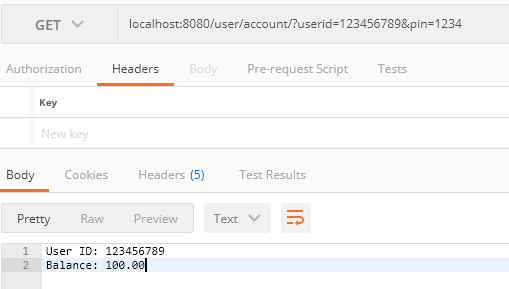

# ATM Interface API
Java Spring Boot API that would interface with an ATM.

**Prerequisites**
* Docker v20.10.10 build b485636

**Running Project**
1. Clone from GitHub. 
2. Build Docker image
3. Run docker image

```
git clone git@github.com:largodeivis/atm.git
docker build -t atm-interface .
docker run -p 8080:8080 atm-interface
```

## How to use:
Has 2 accounts:

User # 1
* User ID: 123456789
* PIN: 1234
* Starting Balance: $100.00

User # 2
* User ID: 987654321
* PIN: 1111
* Starting Balance: $5050.58

## Calling the API
* **Get Account Balance**

_GET_ Request to _/user/account/_ with **userid** and **pin** request parameters.

```
localhost:8080/user/account/?userid=123456789&pin=1234
```




* **Deposit Money Into Account**

_POST_ Request to _/account/deposit/_ with **userid** and **pin** request parameters. The body of the post should be a JSON object with an **amount**.

**Request**
```
localhost:8080/account/deposit?userid=123456789&pin=1234
```

**Request Body**
```
{
"amount": 100
}
```


* **Withdraw Money From Account**

_POST_ Request to _/account/withdraw/_ with **userid** and **pin** request parameters. The body of the post should be a JSON object with an **amount**.

**Request**
```
localhost:8080/account/withdraw?userid=123456789&pin=1234
```

**Request Body**
```
{
"amount": 100
}
```

